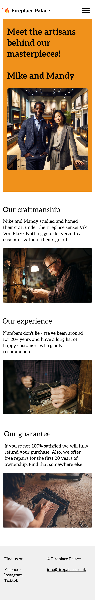

---

# Fireplace Palace

This is a School of Code Challenge for bootcampers to build a working web application using react and nextJs. This web application has a landing page, founders' page and a booking form.

## Table of Content

- [Installation](#Installation)
- [Configuration](#Configuration)
- [Planning](#Planning)
- [Deployed_Website_URL](#Deployed_Website_URL)
- [Resources_links](#Resources_links)
- [Feedback](#Feedback)
- [License](#License)

---

## Installation

_Clone this repository first, then proceed to package installation and configuration._

### Packages and Frameworks installed

**React + NextJs**

**To install React + NextJs:**
Make sure you have Node.js and npm installed on your machine. You can download and install them from https://nodejs.org/.

**Install dependencies:** Run the following command to install the project dependencies:

```
npm install
```

**Start the app:** Run the following command to start the development server:

```
npm run dev
```

Explore more about react and nextJs and its features in the official documentation: [NextJs Documentation](https://nextjs.org/docs).

---

## Configuration

**NextJs Configuration File:**

In the package.json file in the root of the project. Check if the scripts have the following code:

```
"scripts": {
    "dev": "next dev",
    "build": "next build",
    "start": "next start",
    "lint": "next lint"
  },
```

If not, add the code above.

---

## Planning

As we do the planning for the project we focused on tackling one user criteria at a time.

### **Fist phase**

- Creating a landing page
<div style="display: flex; gap: 30px;">


</div>

### **Second phase**

- Adding the founders page

<div style="display: flex; gap: 30px;">




</div>

### **Third phase**

- Adding a booking form

<div style="display: flex; gap: 30px;">


</div>

### **Final phase**

- Validate the booking form


---

## Deployed_Website_URL

- https://fireplace-palace.vercel.app/

---

## Resources_links

Here are for resources used as guid in building the Fireplace Palace web application.

- https://developer.mozilla.org/en-US/docs/Web/JavaScript/Reference/Operators/Spread_syntax
- https://developer.mozilla.org/en-US/docs/Web/JavaScript/Reference/Global_Objects/Object/assign
- https://www.youtube.com/watch?v=0ZJgIjIuY7U
- https://www.youtube.com/watch?v=TOhUqDGNFtA
- https://www.youtube.com/watch?v=RZPAQV7JvNU
- https://nextjs.org/docs/app/building-your-application/optimizing/fonts#google-fonts
- https://allplants.notion.site/An-Opinionated-Guide-to-Building-Unopinionated-Components-0f78a59de16e457c8b7bc3feec205cbd
- https://react.dev/learn/rendering-lists

---

## Feedback

Click this [form](https://soc-hackathon-feedback.netlify.app/) for feedback and questions.

---

## License

[](https://opensource.org/licenses/MIT) .
